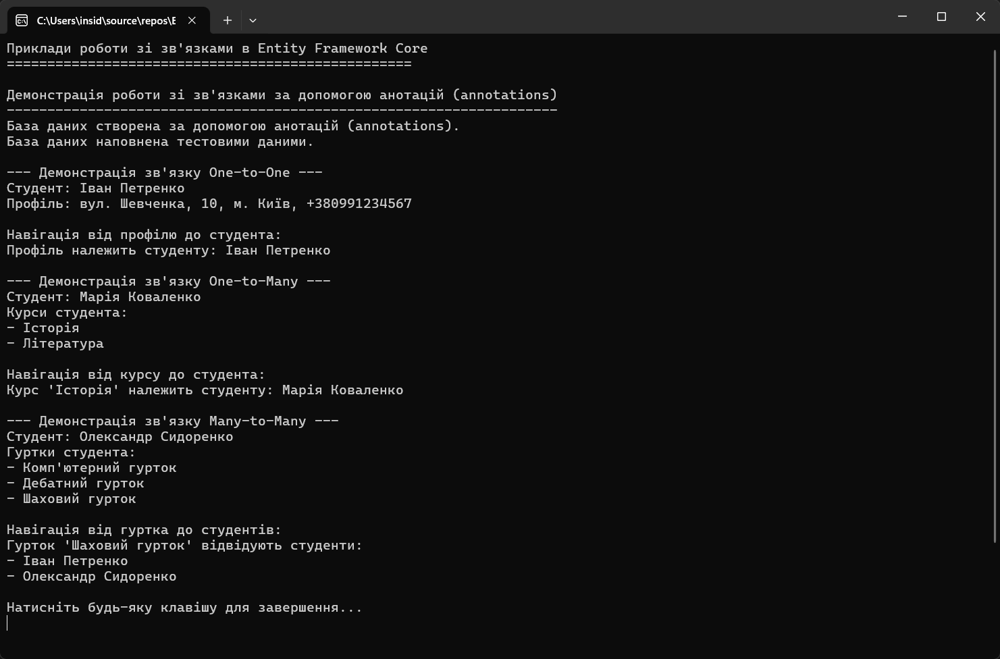
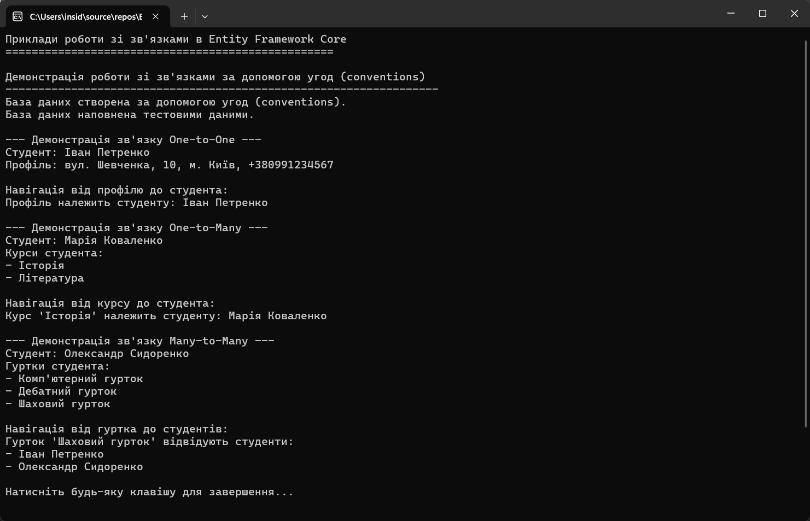

# Entity Framework Core - Приклади зв'язків між таблицями

Цей проект демонструє різні типи зв'язків між таблицями в Entity Framework Core з використанням SQLite. Проект створено для навчальних цілей.

## Зміст

- [Entity Framework Core - Приклади зв'язків між таблицями](#entity-framework-core---приклади-звязків-між-таблицями)
  - [Зміст](#зміст)
  - [Огляд](#огляд)
  - [Типи зв'язків](#типи-звязків)
    - [One-to-One (Один до одного)](#one-to-one-один-до-одного)
    - [One-to-Many (Один до багатьох)](#one-to-many-один-до-багатьох)
    - [Many-to-Many (Багато до багатьох)](#many-to-many-багато-до-багатьох)
  - [Підходи до конфігурації зв'язків](#підходи-до-конфігурації-звязків)
    - [Угоди (Conventions)](#угоди-conventions)
    - [Анотації (Annotations)](#анотації-annotations)
    - [Fluent API](#fluent-api)
  - [Результати роботи програми](#результати-роботи-програми)
    - [Демонстрація зв'язків за допомогою угод (Conventions)](#демонстрація-звязків-за-допомогою-угод-conventions)
    - [Демонстрація зв'язків за допомогою анотацій (Annotations)](#демонстрація-звязків-за-допомогою-анотацій-annotations)

## Огляд

Entity Framework Core (EF Core) - це легковісна, розширювана та крос-платформна версія популярної технології доступу до даних Entity Framework. EF Core є об'єктно-реляційним маппером (ORM), який дозволяє .NET розробникам працювати з базою даних, використовуючи .NET об'єкти, і усуває необхідність більшості коду доступу до даних, який зазвичай потрібно писати.

Цей проект демонструє різні типи зв'язків між таблицями та різні підходи до їх конфігурації в EF Core.

## Типи зв'язків

### One-to-One (Один до одного)

Зв'язок "один до одного" означає, що один запис у таблиці A пов'язаний з одним записом у таблиці B. Наприклад, один студент має один профіль.

```csharp
// Клас Student
public class Student
{
    public int Id { get; set; }
    public string Name { get; set; } = null!;
    
    // Навігаційна властивість для зв'язку один-до-одного
    public StudentProfile? Profile { get; set; }
}

// Клас StudentProfile
public class StudentProfile
{
    public int Id { get; set; }
    public string Address { get; set; } = null!;
    public string PhoneNumber { get; set; } = null!;
    
    // Зовнішній ключ для зв'язку один-до-одного
    public int StudentId { get; set; }
    
    // Навігаційна властивість для зв'язку один-до-одного
    public Student Student { get; set; } = null!;
}
```

### One-to-Many (Один до багатьох)

Зв'язок "один до багатьох" означає, що один запис у таблиці A пов'язаний з багатьма записами в таблиці B. Наприклад, один студент може вивчати багато курсів.

```csharp
// Клас Student
public class Student
{
    public int Id { get; set; }
    public string Name { get; set; } = null!;
    
    // Навігаційна властивість для зв'язку один-до-багатьох
    public List<Course> Courses { get; set; } = new();
}

// Клас Course
public class Course
{
    public int Id { get; set; }
    public string Name { get; set; } = null!;
    
    // Зовнішній ключ для зв'язку один-до-багатьох
    public int StudentId { get; set; }
    
    // Навігаційна властивість для зв'язку один-до-багатьох
    public Student Student { get; set; } = null!;
}
```

### Many-to-Many (Багато до багатьох)

Зв'язок "багато до багатьох" означає, що багато записів у таблиці A пов'язані з багатьма записами в таблиці B. Наприклад, багато студентів можуть відвідувати багато гуртків.

```csharp
// Клас Student
public class Student
{
    public int Id { get; set; }
    public string Name { get; set; } = null!;
    
    // Навігаційна властивість для зв'язку багато-до-багатьох
    public List<Club> Clubs { get; set; } = new();
}

// Клас Club
public class Club
{
    public int Id { get; set; }
    public string Name { get; set; } = null!;
    
    // Навігаційна властивість для зв'язку багато-до-багатьох
    public List<Student> Students { get; set; } = new();
}
```

У EF Core 5.0 і вище, зв'язок "багато до багатьох" може бути налаштований без явного визначення проміжної таблиці. Однак, якщо вам потрібно додати додаткові властивості до зв'язку, ви можете явно визначити проміжну таблицю:

```csharp
// Проміжна таблиця для зв'язку багато-до-багатьох з додатковими властивостями
public class StudentClub
{
    public int StudentId { get; set; }
    public Student Student { get; set; } = null!;
    
    public int ClubId { get; set; }
    public Club Club { get; set; } = null!;
    
    // Додаткова властивість для зв'язку
    public DateTime JoinDate { get; set; }
}
```

## Підходи до конфігурації зв'язків

EF Core пропонує три основні підходи до конфігурації зв'язків між таблицями:

### Угоди (Conventions)

Угоди - це набір правил, які EF Core використовує за замовчуванням для визначення моделі з класів сутностей. Наприклад, властивість з назвою `Id` або `{EntityName}Id` буде автоматично налаштована як первинний ключ.

```csharp
// Зв'язок One-to-One за допомогою угод
public class StudentProfile
{
    // За угодою, якщо властивість називається {NavigationPropertyName}Id, 
    // вона буде використана як зовнішній ключ
    public int StudentId { get; set; }
    
    // Навігаційна властивість
    public Student Student { get; set; } = null!;
}
```

### Анотації (Annotations)

Анотації - це атрибути, які можна застосувати до класів та властивостей для налаштування моделі.

```csharp
// Зв'язок One-to-One за допомогою анотацій
public class StudentProfile
{
    [Key]
    [ForeignKey("Student")]
    public int StudentId { get; set; }
    
    [Required]
    public Student Student { get; set; } = null!;
}
```

### Fluent API

Fluent API надає найбільш потужний спосіб налаштування моделі. Конфігурація виконується в методі `OnModelCreating` контексту бази даних.

```csharp
// Зв'язок One-to-One за допомогою Fluent API
protected override void OnModelCreating(ModelBuilder modelBuilder)
{
    modelBuilder.Entity<StudentProfile>(entity =>
    {
        entity.HasOne(d => d.Student)
            .WithOne(p => p.Profile)
            .HasForeignKey<StudentProfile>(d => d.StudentId)
            .OnDelete(DeleteBehavior.Cascade);
    });
}
```

## Результати роботи програми

### Демонстрація зв'язків за допомогою угод (Conventions)



### Демонстрація зв'язків за допомогою анотацій (Annotations)


